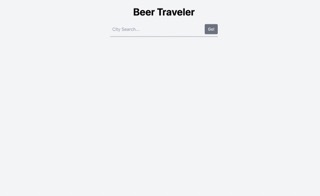
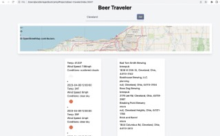

# Beer Traveler

## User Flow

## Project Description
This application will allow a user to search for a location's forecast, the results will include a suggestion of the top brewerys in the area to visit. It will also display a map of that city center using the GoogleMapsAPI.

## User Story
As a traveler I want a web application that can help me find beers based off of the current weather conditions so that i can enjoy beer that fits the weather.

## Acceptance Criteria
WHEN I want to view the weather for a particular city

THEN I can search any city and the current weather will appear

WHEN I am presented with the weather 

THEN I can also seee a list of the top breweries for that city

WHEN I click on a certain brewery 

THEN that I am given details about that particular brewery

## Visuals
When the user loads the page they will be presented with a search bar and the weather and breweries list will be hidden:

A city is entered by the user into the search bar and when go is clicked or enter is pressed a map, the weather, and a list of breweries will appear:

## Installation

## Support

For support the best form of contact will be by email at jkrieger11@gmail.com .

## Roadmap
No specific order: 

Have map show locations of breweries

Based off weather description, show breweries with accommodating features (examples: weather is sunny would show breweries with outdoor patios; weather is rainy would show breweries that have more indoor features)

Animate background of landing page

 

## Contributing

Open to contributions, please send ideas and suggestions in email format with screenshots to jkrieger11@gmail.com.

## Authors and acknowledgment
Mike Novachek
[GitHub](https://github.com/BigMikeNova?tab=repositories "GitHub Repos")

Jacob Andrew
[GitHub](https://github.com/jcandrew1219?tab=repositories "GitHub Repos")

Dorian Walker
[GitHub](https://GitHub.com/dorianwalker29?tab=repositories "GitHub Repos")

Jake Krieger
[GitHub](https://github.com/jkrieger6?tab=repositories "GitHub Repos")
## Usage
Type in a city within the US to get the current weather and future weather to display, a map of the city center to display as well as a list of breweries. When the go button is pressed the weather with the forecast will be displayed on the left side of the page, the list of breweries will appear on the right side of the page, and a map of the city center will appear in the center of the page.

## APIs
https://api.openbrewerydb.org/v1/breweries

https://api.openweathermap.org/data/2.5/forecast?lat=$lat}&lon={lon}&units=imperial&appid={weatherApiKey}

https://api.openweathermap.org/geo/1.0/direct?q={searchLocation}&limit=5&appid={weatherApiKey}

